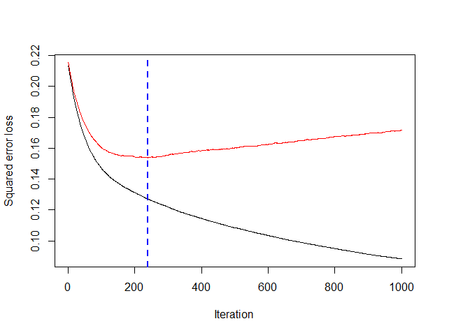
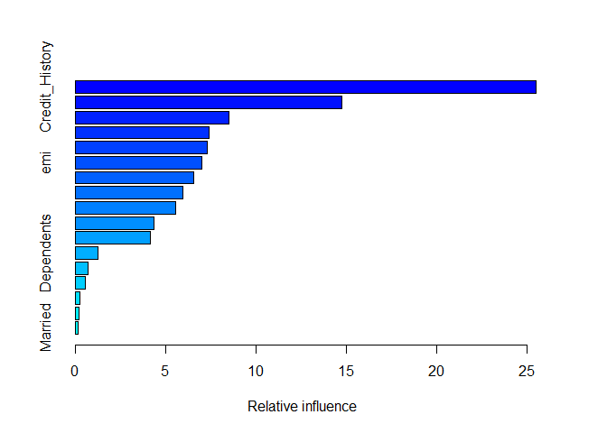
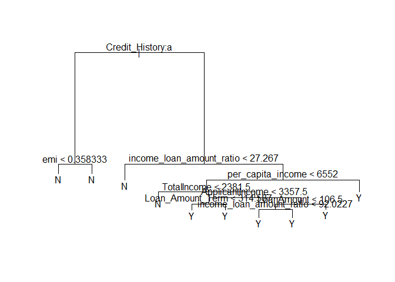

Loan Prediction
================

Project Briefing
================

-   We have a dataset containing information about loan applications. Various attibutes of the loan applicant is captured. We have to predict if a applicant is eligible for a loan based on these attributes.

Importing data
==============

``` r
train = read.csv("D:/EDA/loan/train.csv", na.strings = '')
test = read.csv("D:/EDA/loan/test.csv", na.strings = '')
```

``` r
colSums(is.na(train))
```

    ##           Loan_ID            Gender           Married        Dependents 
    ##                 0                13                 3                15 
    ##         Education     Self_Employed   ApplicantIncome CoapplicantIncome 
    ##                 0                32                 0                 0 
    ##        LoanAmount  Loan_Amount_Term    Credit_History     Property_Area 
    ##                22                14                50                 0 
    ##       Loan_Status 
    ##                 0

``` r
train = train[-c(13)]
df_combined = rbind(train,test)
colSums(is.na(df_combined))/nrow(df_combined)*100
```

    ##           Loan_ID            Gender           Married        Dependents 
    ##         0.0000000         2.4464832         0.3058104         2.5484200 
    ##         Education     Self_Employed   ApplicantIncome CoapplicantIncome 
    ##         0.0000000         5.6065240         0.0000000         0.0000000 
    ##        LoanAmount  Loan_Amount_Term    Credit_History     Property_Area 
    ##         2.7522936         2.0387360         8.0530071         0.0000000

``` r
df_combined$Credit_History = as.factor(df_combined$Credit_History)
```

Data Imputation
===============

``` r
library(missForest)
imputed_data = missForest(df_combined[-c(1)],ntree = 500, variablewise = T,verbose = T )
```

    ##   missForest iteration 1 in progress...done!
    ##     estimated error(s): 0.2089864 0.2443763 0.5292887 0 0.163067 0 0 3245.472 4335.306 0.2028825 0 
    ##     difference(s): 1.67635e-06 0.004514344 
    ##     time: 8.34 seconds
    ## 
    ##   missForest iteration 2 in progress...done!
    ##     estimated error(s): 0.2068966 0.2402863 0.5282427 0 0.163067 0 0 3285.675 4290.089 0.2084257 0 
    ##     difference(s): 2.349432e-08 0.001164992 
    ##     time: 7.83 seconds
    ## 
    ##   missForest iteration 3 in progress...done!
    ##     estimated error(s): 0.2110763 0.2310838 0.5303347 0 0.1511879 0 0 3202.596 4324.929 0.2050998 0 
    ##     difference(s): 9.522709e-09 0.000582496 
    ##     time: 7.7 seconds
    ## 
    ##   missForest iteration 4 in progress...done!
    ##     estimated error(s): 0.2089864 0.2310838 0.5376569 0 0.163067 0 0 3267.315 4294.467 0.2095344 0 
    ##     difference(s): 7.355907e-09 0.000582496 
    ##     time: 7.78 seconds
    ## 
    ##   missForest iteration 5 in progress...done!
    ##     estimated error(s): 0.2058516 0.2372188 0.5292887 0 0.1522678 0 0 3239.689 4302.463 0.2062084 0 
    ##     difference(s): 6.387127e-09 0.000436872 
    ##     time: 7.94 seconds
    ## 
    ##   missForest iteration 6 in progress...done!
    ##     estimated error(s): 0.2037618 0.2290389 0.5313808 0 0.1576674 0 0 3263.167 4294.639 0.2028825 0 
    ##     difference(s): 1.12193e-08 0.000582496 
    ##     time: 7.95 seconds

``` r
df_imputed = imputed_data$ximp
```

-   We use missForrest package for data imputation as there are many categorical variables in the data. missforrest package handles categorical data well.

-   Next we try to derive some additional features that can given hidden information about the data.
-   We calculate the **Total Income** of Applicant and Co-Applicant as it is a better indicator of the income of the loan seeking party.
-   We also take into consideration the **number of dependants** a person has and diving the total income by the number of dependants would indicate his relative ability to pay back for a loan. We call this \*\* per capita income \*\*. So, for married persons the number of dependants may be more where as for single persons the expenditures on dependants would be less.( We test this hypothesis with some visual graphs)
-   We also calculate the ratio of **Total income and Loan amount**. It can indicate if a loan is in proprotion to the total income of a person. This can help banks avoid \*\* sub-prime loans\*\*
-   Next, we calculate the **EMI** BASED ON THE LOAN AMOUNT and LOAN TERM PERIOD.
-   We also derive a metric to acertain the \*\* EMI paying capacity\*\* of a person based on his \*\* per capita income \*\* of his family and the \*\* EMI \*\*. \#Feature Engineering

``` r
df_imputed$Dependents = as.character(df_imputed$Dependents)
df_imputed[df_imputed$Dependents == '3+',]$Dependents = 4
df_imputed$Dependents = as.integer(df_imputed$Dependents)

df_imputed$TotalIncome = df_imputed$ApplicantIncome + df_imputed$CoapplicantIncome

df_imputed$per_capita_income = ifelse(df_imputed$Married=='Yes',df_imputed$TotalIncome/(df_imputed$Dependents+2),df_imputed$TotalIncome/(df_imputed$Dependents+1)) 

df_imputed$income_loan_amount_ratio = df_imputed$TotalIncome/df_imputed$LoanAmount

df_imputed$pci_loan_ratio = df_imputed$per_capita_income/df_imputed$LoanAmount

df_imputed$emi = df_imputed$LoanAmount/df_imputed$Loan_Amount_Term

df_imputed$emi_pay_capacity = df_imputed$emi/df_imputed$per_capita_income
```

Machine Learning!
=================

-   We make several models using different algorithms, and compare the results.
-   We will be using *Random Forrest* , *GBM*
-   We will also use parametic tuning to get the best parameters for our classifier.
-   Finally, We will use ensemble learning to pick the best results.

Model Fitting - Random Forest
=============================

``` r
train_1 = df_imputed[1:614,]
test_1 = df_imputed[615:981,]
train = read.csv("D:/EDA/loan/train.csv", na.strings = '')
train_1$Loan_status = train$Loan_Status

#Parameter tuning!
library(caret)
classifier_tuning = train(form = Loan_status~.,data = train_1,method = 'rf' )
classifier_tuning$bestTune
```

    ##   mtry
    ## 1    2

``` r
# we get mtry = 2
library(randomForest)
classifier = randomForest(x = train_1[-c(18)],
                          y = train_1$Loan_status,
                          ntree = 5000,
                          mtry = 2)
y_pred = predict(classifier,newdata = test_1)

classifier$importance
```

    ##                          MeanDecreaseGini
    ## Gender                           2.235739
    ## Married                          2.469827
    ## Dependents                       4.844542
    ## Education                        3.273147
    ## Self_Employed                    2.167410
    ## ApplicantIncome                 19.173628
    ## CoapplicantIncome               13.251701
    ## LoanAmount                      18.190296
    ## Loan_Amount_Term                 6.125179
    ## Credit_History                  48.184021
    ## Property_Area                    7.745040
    ## TotalIncome                     20.395268
    ## per_capita_income               19.493954
    ## income_loan_amount_ratio        22.626965
    ## pci_loan_ratio                  18.753942
    ## emi                             18.332081
    ## emi_pay_capacity                19.309758

-   We see that *Credit\_History* is the most important variable in the Random Forest model. \#Model fitting - GBM

``` r
library(gbm)
classifier_gbm = gbm.fit(x = train_1[-18],
                    y = train_1$Loan_status,
                    distribution = 'gaussian',
                    n.trees = 1000,
                    interaction.depth = 3,
                    shrinkage = 0.01,
                    nTrain = 0.8*nrow(train_1))
```

    ## Iter   TrainDeviance   ValidDeviance   StepSize   Improve
    ##      1        0.2130          0.2152     0.0100    0.0013
    ##      2        0.2117          0.2139     0.0100    0.0013
    ##      3        0.2104          0.2127     0.0100    0.0014
    ##      4        0.2090          0.2114     0.0100    0.0013
    ##      5        0.2079          0.2102     0.0100    0.0010
    ##      6        0.2065          0.2089     0.0100    0.0015
    ##      7        0.2051          0.2078     0.0100    0.0011
    ##      8        0.2040          0.2068     0.0100    0.0010
    ##      9        0.2028          0.2056     0.0100    0.0008
    ##     10        0.2018          0.2047     0.0100    0.0011
    ##     20        0.1905          0.1948     0.0100    0.0009
    ##     40        0.1735          0.1811     0.0100    0.0004
    ##     60        0.1617          0.1716     0.0100    0.0004
    ##     80        0.1533          0.1651     0.0100    0.0002
    ##    100        0.1471          0.1603     0.0100    0.0002
    ##    120        0.1425          0.1578     0.0100   -0.0000
    ##    140        0.1389          0.1561     0.0100    0.0001
    ##    160        0.1360          0.1550     0.0100    0.0000
    ##    180        0.1335          0.1549     0.0100    0.0000
    ##    200        0.1313          0.1544     0.0100   -0.0000
    ##    220        0.1292          0.1543     0.0100   -0.0000
    ##    240        0.1271          0.1539     0.0100   -0.0001
    ##    260        0.1252          0.1542     0.0100    0.0000
    ##    280        0.1235          0.1545     0.0100   -0.0000
    ##    300        0.1220          0.1556     0.0100   -0.0001
    ##    320        0.1202          0.1561     0.0100   -0.0000
    ##    340        0.1186          0.1568     0.0100   -0.0001
    ##    360        0.1171          0.1572     0.0100   -0.0001
    ##    380        0.1159          0.1578     0.0100   -0.0001
    ##    400        0.1146          0.1584     0.0100   -0.0001
    ##    420        0.1132          0.1588     0.0100   -0.0001
    ##    440        0.1120          0.1590     0.0100   -0.0000
    ##    460        0.1108          0.1593     0.0100   -0.0000
    ##    480        0.1095          0.1596     0.0100    0.0000
    ##    500        0.1085          0.1602     0.0100   -0.0001
    ##    520        0.1076          0.1607     0.0100   -0.0000
    ##    540        0.1065          0.1614     0.0100   -0.0001
    ##    560        0.1054          0.1612     0.0100   -0.0000
    ##    580        0.1044          0.1620     0.0100   -0.0000
    ##    600        0.1035          0.1623     0.0100   -0.0001
    ##    620        0.1026          0.1633     0.0100   -0.0001
    ##    640        0.1016          0.1631     0.0100   -0.0001
    ##    660        0.1006          0.1639     0.0100   -0.0000
    ##    680        0.0998          0.1643     0.0100   -0.0001
    ##    700        0.0990          0.1649     0.0100   -0.0000
    ##    720        0.0982          0.1654     0.0100   -0.0001
    ##    740        0.0974          0.1657     0.0100   -0.0000
    ##    760        0.0966          0.1664     0.0100   -0.0000
    ##    780        0.0958          0.1668     0.0100   -0.0000
    ##    800        0.0951          0.1674     0.0100   -0.0000
    ##    820        0.0943          0.1679     0.0100   -0.0000
    ##    840        0.0936          0.1680     0.0100   -0.0000
    ##    860        0.0929          0.1684     0.0100   -0.0000
    ##    880        0.0921          0.1689     0.0100   -0.0001
    ##    900        0.0914          0.1695     0.0100   -0.0000
    ##    920        0.0907          0.1699     0.0100   -0.0000
    ##    940        0.0901          0.1700     0.0100   -0.0001
    ##    960        0.0896          0.1708     0.0100   -0.0001
    ##    980        0.0890          0.1710     0.0100   -0.0001
    ##   1000        0.0884          0.1715     0.0100   -0.0001

``` r
gbm.perf(classifier_gbm)
```

    ## Using test method...



    ## [1] 239

``` r
summary(classifier_gbm)
```



    ##                                               var    rel.inf
    ## Credit_History                     Credit_History 25.4992834
    ## income_loan_amount_ratio income_loan_amount_ratio 14.7573238
    ## per_capita_income               per_capita_income  8.4913789
    ## ApplicantIncome                   ApplicantIncome  7.4068512
    ## LoanAmount                             LoanAmount  7.2831067
    ## emi                                           emi  6.9956733
    ## emi_pay_capacity                 emi_pay_capacity  6.5648578
    ## TotalIncome                           TotalIncome  5.9504697
    ## pci_loan_ratio                     pci_loan_ratio  5.5384882
    ## CoapplicantIncome               CoapplicantIncome  4.3634874
    ## Property_Area                       Property_Area  4.1153735
    ## Dependents                             Dependents  1.2291272
    ## Loan_Amount_Term                 Loan_Amount_Term  0.6723748
    ## Education                               Education  0.5544401
    ## Self_Employed                       Self_Employed  0.2494785
    ## Gender                                     Gender  0.2010065
    ## Married                                   Married  0.1272790

``` r
pred1 = predict(classifier_gbm, newdata = test_1, n.trees = 836, type = 'response')
pred1 = ifelse(pred1<1.5,"N","Y")
```

-   In gbm too, we see that credit history is the most important variable.
-   We apply a decision tree now to get a visual picture.

Decision Tree
=============

``` r
library(tree)
classifier_tree = tree(data = train_1,
                       formula = Loan_status~.)
plot(classifier_tree)
text(classifier_tree)
```



``` r
pred1 = predict(classifier_tree, newdata = test_1,type = 'class')
```

Final Results
=============

``` r
result = as.data.frame(cbind(as.character(test$Loan_ID),as.character(pred1)))
colnames(result) = c('Loan_ID','Loan_Status')
write.csv(result,file = "D:/EDA/loan/feature-engineering-tree1.csv",row.names = F)
```
